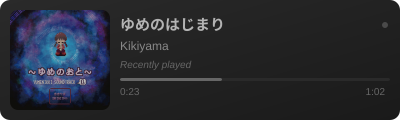

Minimal service that converts your current spotify track into an embeddable SVG.

# Current playing


# Recently played


# Installation
1. Rename the `example.application.properties` to `application.properties`
   ```bash
   mv ./src/main/resources/example.application.properties application.properties
   ```

2. **Create a Spotify Developer App**
   - Go to https://developer.spotify.com/dashboard
   - Click "Create app"
   - Set redirect URI to: `http://127.0.0.1:5555/callback`
   - Copy your Client ID and Client Secret


3. **Add credentials to `./application.properties`**

```sh
spotify.client-id=your_spotify_client_id
spotify.client-secret=your_spotify_client_secret
```

4. **Get authorization code**

Open this URL in your browser (replace `YOUR_CLIENT_ID`):

```
https://accounts.spotify.com/authorize?client_id={YOUR_CLIENT_ID}&response_type=code&redirect_uri=http://127.0.0.1:5555/callback&scope=user-read-recently-played%20user-read-currently-playing%20user-read-playback-state
```

After authorizing, you'll be redirected to a URL like:
```
http://127.0.0.1:5555/callback?code=AQB3tYro...
```

Copy the `code` parameter value.

5. **Exchange code for refresh token**

```sh
curl -X POST "https://accounts.spotify.com/api/token" \
  -H "Content-Type: application/x-www-form-urlencoded" \
  -H "Authorization: Basic $(echo -n 'YOUR_CLIENT_ID:YOUR_CLIENT_SECRET' | base64)" \
  -d "grant_type=authorization_code" \
  -d "code=YOUR_CODE_FROM_STEP_3" \
  -d "redirect_uri=http://127.0.0.1:5555/callback"
```

6. **Save refresh token**

From the response JSON, copy the `refresh_token` value and add it to `./application.properties`:

```sh
spotify.refresh-token=your_refresh_token_here
```

Done! Your `./application.properties` should now have all three values. The access token will auto-refresh when needed.

7. build the application
    ```bash
      ./mvnw clean install
    ```
8. Use the `target/spotify-current-readme-0.0.1-SNAPSHOT.jar` and deploy your application.

# sample
check out my profile! https://github.com/qeqqe